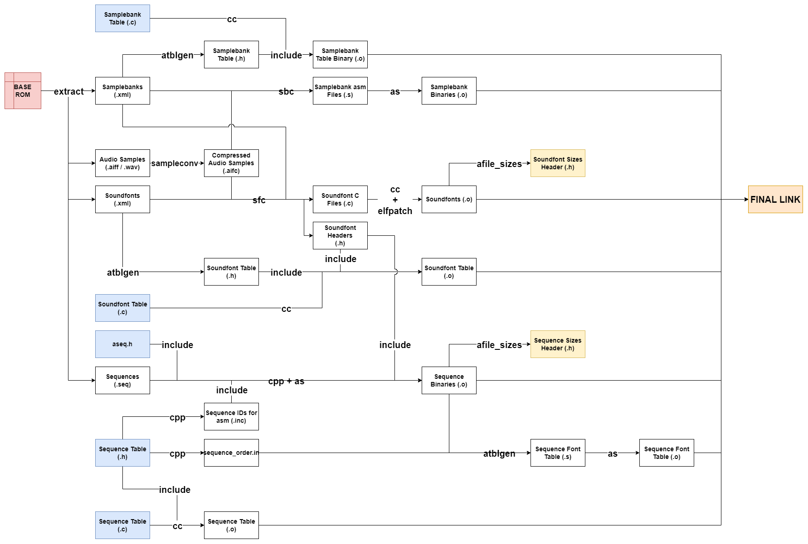

# Z64 Audio Tools

The Z64 Audio Tools work together to implement the full audio asset pipeline

## z64sample

Converts aifc <-> aiff / wav

Used in extraction and build.

## sbc

Converts samplebank xml + aifc -> S

Q: Why asm file?
A: Faster assembly, defining ABS symbols is easy in an asm file.

## sfc

Converts soundfont & samplebank xml + aifc -> C

Q: Why convert to C?
A: It will error if a relevant struct changes definition, rather than building the audiobank file and then crashing at runtime.

## elfpatch

`Usage: elfpatch in.elf out.elf`

This tool patches the symbol table of an ELF file (`in.elf`) to make every defined symbol in the file an absolute symbol. This is a required step for building soundfonts from C source as all pointers internal to a soundfont are offset from the start of the soundfont file and not the audiobank segment as a whole. Making all defined symbols ABS symbols prevents the linker from updating their values later.

## atblgen

Generates various audio code tables.

- Samplebank table
- Soundfont table
- Sequence font table

The sequence table is not generated as some things in that table are better left manual, such as sequence flags. This also lets us have the sequence table before assembling any sequence files which is nice for some sequence commands like `runseq`.

## afile_sizes

Produces header files containing binary file sizes for a given directory. Used to produce headers containing soundfont and sequence files and the number of each for use in code files.

## extraction

This collection of python files implements the extraction of audio data from a base ROM.

`audio_extract.py` is the primary runnable here.
`disassemble_sequence.py` is also runnable but is not used that way in either extraction or building.

See individual python source files for individual explanations.
